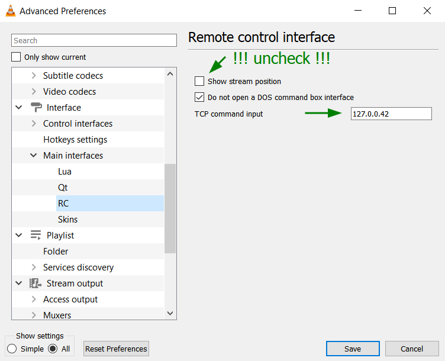

Setup VLC instances
===================

`Vlcsync` assumes that `vlc` start with enabled "Remote control interface" (tcp) on address `127.0.0.42` 

This allows you to automatically find running `vlc` instances by simply looking listening ports. 
Each instance of the program will run on a random port, but with a unique address `127.0.0.42:*`

You have next options how to configure `vlc` for this:

- Run vlc from command line with option `vlc --rc-host 127.0.0.42`
- Set via gui preferences, suitable for Windows, tested on Win 10   
  (need restart `vlc` after save settings)

  
  
  

In success case a program show you "Found instances" at start: 


## Troubleshooting

- To check `vlc` connections (on linux)
  ```shell
  $ netstat -4nlpt | grep 127.0.0.42
  ```
  
- You can connect to `vlc` via `telnet` (or i.e. `putty` with raw mode) and enter commands manually from keyboard:
  ```shell
  $ telnet 127.0.0.42 12345
  
  Trying 127.0.0.42...
  Connected to 127.0.0.42.
  Escape character is '^]'.
  VLC media player 3.0.9.2 Vetinari
  Command Line Interface initialized. Type `help' for help.
  > get_time
  1234
  > seek 100
  > help
  ...
  ```

In case of difficulties just let me know, we will try to solve you issues. 